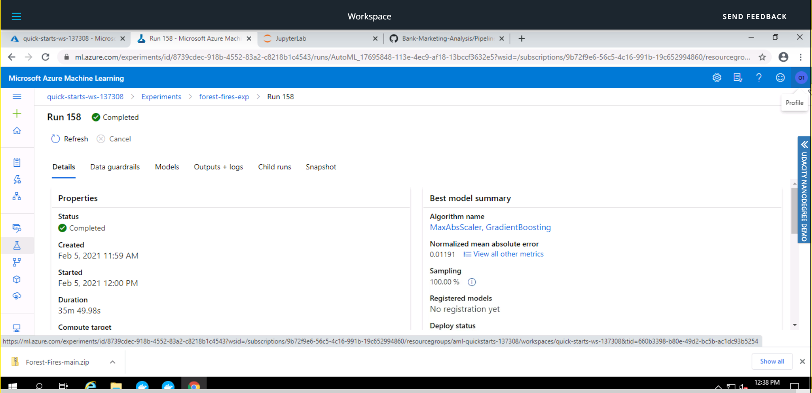

# Prediction of Area burnt by Forest Fires

In the present times, one of the serious threats to the environment is climate change. A direct result of climate change is Forest fires which has the capability to cause severe damage to the ecology. This project is an attempt to predict the area burnt by a potential forest fire. The problem is formulated as a regression problem based on meteorological factors that influences forest fires such as humidity, wind speed, rain etc., available in the Forest Fires Dataset.

## Dataset

### Overview
The Forest Fires dataset is available in the UCI Machine Learning Repository. It consists of details regarding forest fires in northeast region of Portugal.

### Task
The aim is to predict the burnt area. The features are:
 
 1. X - x-axis spatial coordinate within the Montesinho park map: 1 to 9
 1. Y - y-axis spatial coordinate within the Montesinho park map: 2 to 9
 1. month - month of the year: 'jan' to 'dec'
 1. day - day of the week: 'mon' to 'sun'
 1. FFMC - FFMC index from the FWI system: 18.7 to 96.20
 1. DMC - DMC index from the FWI system: 1.1 to 291.3
 1. DC - DC index from the FWI system: 7.9 to 860.6
 1. ISI - ISI index from the FWI system: 0.0 to 56.10
 1. temp - temperature in Celsius degrees: 2.2 to 33.30
 1. RH - relative humidity in %: 15.0 to 100
 1. wind - wind speed in km/h: 0.40 to 9.40
 1. rain - outside rain in mm/m2 : 0.0 to 6.4
 1. area - the burned area of the forest (in ha): 0.00 to 1090.84

### Access
* The `TabularDatasetFactory` class contains a method called `from_delimited_files` which takes a url as input and creates a `TabularDataset`. This dataset can be then converted to a DataFrame using `to_pandas_dataframe` method.
* dataset url: http://archive.ics.uci.edu/ml/machine-learning-databases/forest-fires/forestfires.csv

## Automated ML
Settings and Configurations of AutoML:

* Primary metric: Normalized Mean Absolute Error
  It gives a normalized score of the average difference between the predicted and actual burnt area.
  
* Cross Validation: 5
  The dataset will be split into 5 parts. Four of them will be used for training and one for testing. This is repeated until each part has become the test set once.
  
* Experiment Timeout Minutes: 30

* Max Concurrent Iterations: 4 ( Same as maximum number of nodes in compute cluster )

### Results
* The best AutoML model is MaxAbsScaler,Gradient boosting with a Mean Absolute Error of 12.989 . The error can be further reduced by running the experiment longer and enabling Deep Learning.

### Future Improvements
* Experiment Timeout Minutes can be increased which will result in better ensemble models.
* Deep Learning can be Enabled.
* A parameter named featurization is set to 'auto' by default. This means that the a attribute type is automatically detected and feature engineering is performed based on that. This can be improved by defining a custom featurizationConfig object which might improve the quality of the data.

### Screenshots

* The AutoML run is complete and the best model is shown along with its metrics.
  
* The `RunDetails` widgets shows that the run is complete.
  
* The RunID of the best AutoML run is shown.
  
* Along with the primary metric, other metrics are displayed.
  
* Parameters of the best model
  

## Hyperparameter Tuning
The model chosen for Hyperparameter Tuning is a Support Vector Regressor(SVR). Since the dataset has many features, SVR is an appropriate choice as it works well in high dimentional spaces.

List of Hyperparameters tuned

* C: Inverse of regularization strength. Smaller values cause stronger regularization. (1.0, 3.0, 10.0, 100.0)
* gamma: kernel coefficient for RBF kernel. ('Scale','Auto')
* epsilon: no penalty is associated in the training loss function with points predicted within a distance epsilon from the actual value. (0.1, 0.01, 0.001, 0.0001)

* The parameter sampler used is RandomParameterSampling. As this sampler chooses a value for each of parameters randomly, after a certain number of runs all combinations will be tried out and the best one can be chosen.
* The early stopping policy used is BanditPolicy. Its parameters are set such that in every alternate interval the policy is applied. This will terminate runs that are not performing well based on the slack factor. This reduces the wastage of compute resources.

### Results
The best set of hyperparameters produced a Mean Absolute Error of 13.368 .
* C: 1
* gamma: scale
* epsilon 0.1

### Future Improvements
* The model can be further improved by trying out different kernel functions.
* Since the 'area' column contains lots of zeroes, 'hurdle regression' based models can be tried out. A hurdle model is a class of statistical models where a random variable is modelled using two parts, the first which is the probability of attaining value 0, and the second part models the probability of the non-zero values

### Screenshots
* The `RunDetails` widgets shows that run properties and child runs.
 
 
* The best HyperDrive run with its hyperparameters and RunID is displayed.
 
* The Child runs of HyperDrive.
 

## Model Deployment
* The model created by AutoML has a slightly lower error hence, it has been chosen for deployment.

* Steps for Deployment and Interaction with the model:
1. Register the model.
1. Create an inference configuration. It needs two things: a script for scoring and an environment where the deployed model can run. The scoring script will take input in the form of json, feed it to the model and return the results in the form of json.
1. Create a deployment configuration. Azure Container Instance has been chosen with a memory of 1 GB and single core.
1. Deploy the model
1. Create a json file with the input data
1. Make a HTTP request to the webservice using the scoring uri to get the results.

### Environment Details
* The enviroment used for inference is AzureML-Tutorial which is one of the curated environments provided by Azure. Environment files are available in 
* Environment files of AutoML environment are available in 

### Screenshots
* The model has been deployed using Azure Container Instance.
 
* The deployed model can be accessed at the REST endpoint using a HTTP request. Application Insights has been enabled.
 
* The webservice is in a healthy state.
 
* The results from the deployed models for the two input data points.
 
* Logs from the deployed model are shown below.
 
 
## Screen Recording
* https://youtu.be/S_pfUnAwa64
